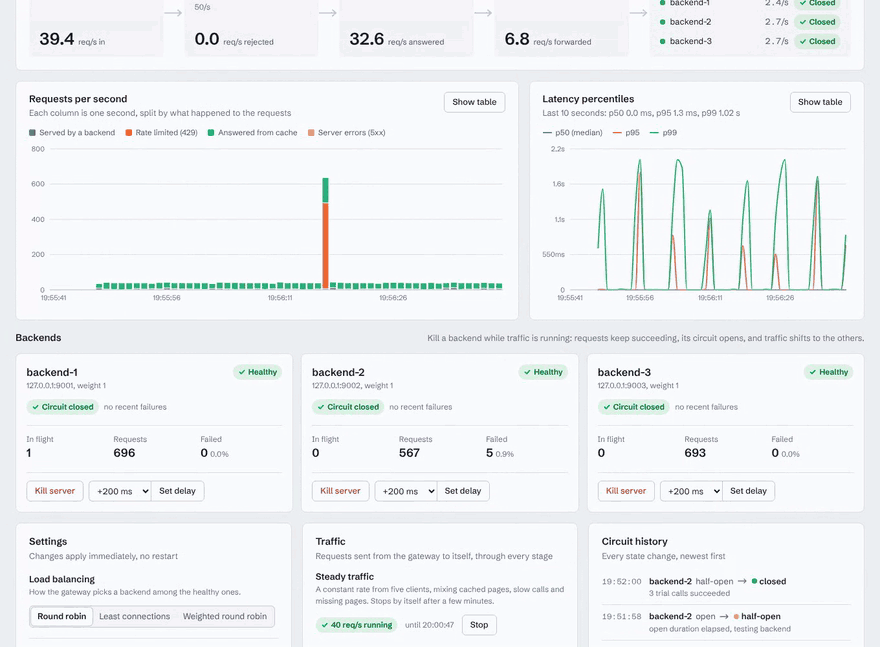
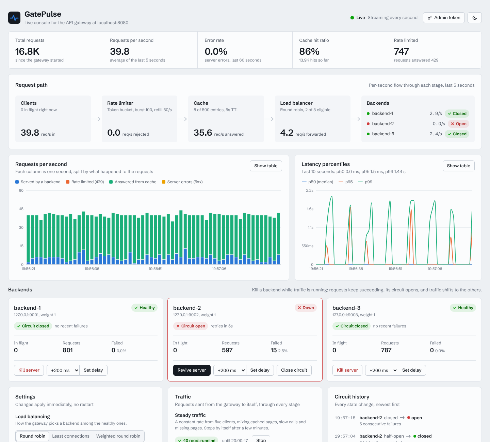
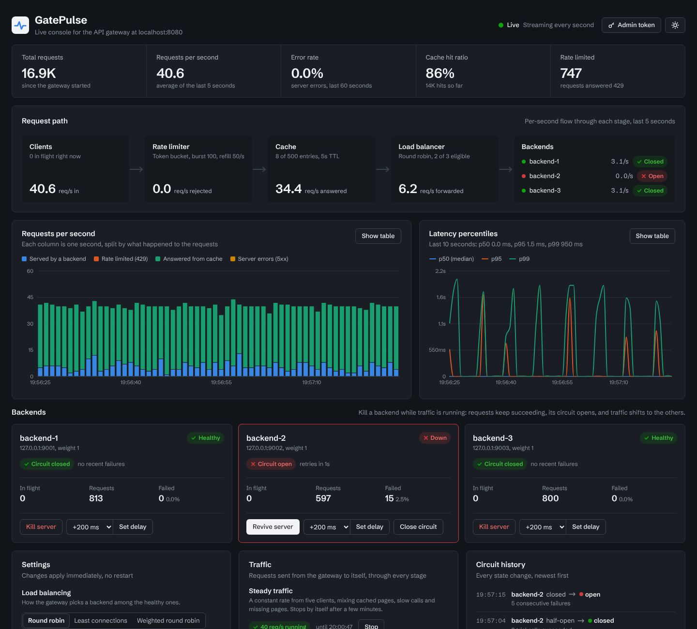
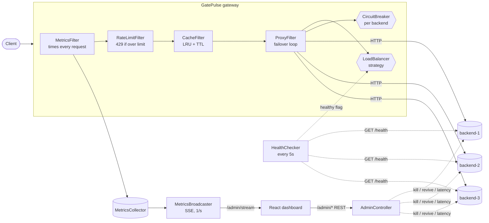
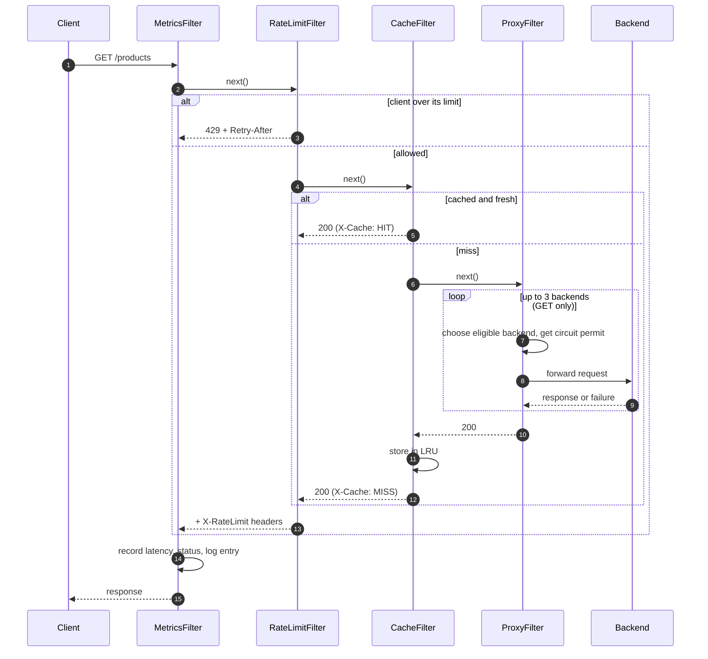

# GatePulse

**A mini API gateway in Java 21 with a live dashboard.** Rate limiting, load balancing, response
caching, health checking and circuit breaking are all **written from scratch** (no Resilience4j,
Bucket4j, Hystrix or Guava). A React console streams the gateway's traffic in real time and has
chaos buttons: kill a backend in the middle of a load test and watch the gateway route around it
with no client-visible errors.

**Live demo:** [dashboard on Vercel](https://gate-pulse-lake.vercel.app/), talking to the
[gateway on Render](https://gatepulse-gateway.onrender.com/health). Both run on free tiers: if the
gateway has been idle, the dashboard shows *"Waking up the gateway…"* for 30-60 seconds first.

[](https://github.com/Shashwat0906/GatePulse/actions/workflows/ci.yml)




| Light | Dark |
|---|---|
|  |  |

---

## Contents

- [Features](#features)
- [Architecture](#architecture)
- [Design decisions and trade-offs](#design-decisions-and-trade-offs)
- [Concurrency design](#concurrency-design)
- [Load test results](#load-test-results)
- [Run it locally](#run-it-locally)
- [Deploy (Render + Vercel)](#deploy-render--vercel)
- [Configuration reference](#configuration-reference)
- [Admin API](#admin-api)
- [Testing](#testing)
- [Project structure](#project-structure)
- [Limitations and future work](#limitations-and-future-work)
- [Interview Q&A](docs/INTERVIEW_QA.md)

## Features

| Area | What it does | Where |
|---|---|---|
| **Rate limiting** | Token bucket (lock-free, CAS) and sliding window log, switchable at runtime. Per client (API key, otherwise IP). `429` with `Retry-After`, `X-RateLimit-Limit` and `X-RateLimit-Remaining`. Idle clients are evicted safely. | `ratelimit/` |
| **Load balancing** | Round robin, least connections, smooth weighted round robin (nginx algorithm, lock-free via a precomputed schedule). Switchable at runtime. Only healthy backends with non-open circuits are eligible. | `loadbalancer/` |
| **Circuit breaker** | One per backend. CLOSED → OPEN → HALF_OPEN using the State pattern, with configurable threshold, open duration and trial count. Permits stop late results from polluting a newer state. Every transition is timestamped for the dashboard. | `circuitbreaker/` |
| **Cache** | LRU built by hand (HashMap + doubly linked list), per-entry TTL, `X-Cache: HIT/MISS/BYPASS`, hit ratio and eviction stats, capacity and TTL changeable at runtime. | `cache/` |
| **Failover** | A failed idempotent request (connection error, timeout or 5xx) is retried on a *different* backend. POST/PATCH are never retried. | `proxy/ProxyFilter` |
| **Health checks** | Parallel `/health` probes every 5s, with hysteresis (N failures to mark down, M successes to mark up). | `health/` |
| **Metrics** | Requests/sec, error rate, status codes, p50/p95/p99 from a lock-free log-linear histogram, cache and per-backend stats, 429 count, a live request log. | `metrics/` |
| **Admin API** | Snapshot (`/admin/metrics`), Server-Sent Events stream (`/admin/stream`), runtime config, chaos actions and a traffic generator. Changes are protected by `ADMIN_TOKEN`. | `admin/` |
| **Dashboard** | Stat row, request-path diagram, live charts, backend cards with animated circuit badges, settings, chaos and traffic controls, request log. SSE with auto-reconnect and polling fallback, a cold-start screen, light and dark themes. | `dashboard/` |
| **DevOps** | Multi-stage Docker images, `docker compose up` for the full system, GitHub Actions CI (tests, lint, image builds, compose smoke test), k6 load-test workflow, Render blueprint, Vercel config. | `.github/`, `load-test/` |

## Architecture



### What happens to one request



The filters form a **Chain of Responsibility** (`core/Filter`, `core/FilterChain`) and never
import Javalin, so each one is unit-tested with a hand-built `RequestContext`. Load balancing and
circuit breaking are collaborators of `ProxyFilter` rather than separate filters, because failover
re-runs "choose → check breaker → call" for one request (see the
[interview Q&A](docs/INTERVIEW_QA.md#3-why-chain-of-responsibility-for-the-pipeline)).

## Design decisions and trade-offs

**Token bucket and sliding window log, side by side.** Token bucket allows controlled bursts and
needs two numbers per client. Sliding window log is exact (no 2× burst at window edges, unlike a
fixed-window counter) but stores up to `limit` timestamps per client. Both sit behind
`RateLimitStrategy`, so the trade-off can be shown live from the dashboard.

**Lazy over scheduled.** Token refill, circuit OPEN → HALF_OPEN and cache expiry all happen when
a request notices the time has passed, not on a timer. That means fewer threads, nothing to keep
in sync, and no work for idle clients.

**In memory, single instance.** It's the fastest and simplest design for one gateway, which is
what this project runs. What breaks with several instances, and how to fix it, is listed under
[limitations](#limitations-and-future-work).

**SSE over WebSockets.** Data flows one way (server → browser); commands are normal REST calls.
SSE is plain HTTP, survives proxies and free hosting, and `EventSource` reconnects by itself. The
server serializes one snapshot per second and sends the same string to every viewer.

**Metrics outermost, not last.** The spec's flow ends with "Metrics", but a filter placed last
never sees requests answered earlier (429s, cache hits). Wrapping the whole chain measures true
gateway latency and counts everything.

**Retry only idempotent methods.** Retrying a timed-out POST could duplicate a side effect, so
POST and PATCH get exactly one attempt.

**4xx is a success for the circuit breaker.** A 404 proves the backend is alive; only connection
errors, timeouts and 5xx count as failures.

**Gateway `/health` is always 200 while the process runs.** If it reported backend health, Render
would restart a perfectly good gateway whenever the backends were down.

**Virtual threads (Java 21).** Each proxied request blocks while waiting for a backend. On virtual
threads that blocking is cheap, so throughput isn't capped by a thread-pool size, and the code
stays simple blocking code (no reactive chains).

**Hand-written JSON responses, one shared `ObjectMapper`, async logging.** Small things on the hot
path that keep latency low.

## Concurrency design

| Component | Shared state | Technique | Why |
|---|---|---|---|
| Token bucket | per-client (tokens, lastRefill) | immutable record in `AtomicReference` + CAS retry loop | lock-free; two threads can't spend the last token |
| Sliding window | per-client timestamp ring | one monitor **per client** | different clients never contend; no global lock |
| Rate limiter config | (config, strategy) pair | swapped atomically via `AtomicReference` | a request never sees a half-applied config |
| Idle eviction | client maps | "retire, then remove" handshake | an in-flight request never uses an evicted entry |
| Round robin / WRR | ticket counter | `AtomicLong.getAndIncrement` | unique ticket per request |
| Weighted RR schedule | precomputed cycle | immutable, published via `volatile` | smooth WRR without locking per pick |
| Least connections | in-flight count per backend | `AtomicInteger` | exact count, read without locking |
| Circuit breaker | current state object | `AtomicReference` + CAS transitions; permits tied to the issuing state | exactly one transition when many threads cross a threshold |
| LRU cache | map + linked list | one `ReentrantLock` (short critical section) | `get` mutates order, so true lock-freedom isn't practical; see Q&A 11 |
| Metrics totals | counters | `LongAdder` | many writers, rare readers |
| Per-second buckets | ring of 120 seconds | `AtomicReferenceArray` + CAS to install a new second | no lock, no cleanup thread |
| Latency histogram | 368 buckets | `AtomicLongArray` | one atomic increment per request |
| Request log | ring of 1,024 records | sequence numbers + `AtomicReferenceArray` | lock-free; readers resume from their last sequence |
| SSE broadcast | open connections | single broadcaster thread writes to every connection | one writer per connection, no interleaved frames |

Every one of these has a test that releases many threads at once (`CountDownLatch`) and asserts
an **exact** invariant: exactly `capacity` tokens granted, exactly one transition, exactly
`halfOpenTrials` permits, an exact weighted split over 98,000 picks, and LRU map/list consistency.

## Load test results

Measured with [k6](https://k6.io) by the [`Load test`](.github/workflows/load-test.yml) workflow on a
GitHub-hosted runner (**AMD EPYC 7763, 4 vCPU, 16 GB RAM**, OpenJDK 21, k6 v2.3). k6 and the gateway, with its three embedded backends,
**share the same machine**, so these numbers are conservative. Each scenario gets a freshly started
gateway after a 10-second warm-up.

| Scenario | What it does | Requests | Throughput | p50 | p95 | p99 | Errors |
|---|---|---|---|---|---|---|---|
| **Steady** | 2,000 req/s for 60 s, 200 clients, half the requests bypass the cache | 120,002 | 2,000 req/s | 0.4 ms | 0.8 ms | 3.3 ms | **0.00%** |
| **Spike** | 100 → 4,000 req/s in 10 s, held for 20 s, from only 20 clients | 112,249 | 2,245 req/s avg | 0.2 ms | 1.0 ms | 3.0 ms | **0 server errors**; 75,381 answered `429` by design |
| **Failover** | 500 req/s, no caching; backend-2 killed at 15 s, revived at 40 s | 30,003 | 500 req/s | 0.5 ms | 0.7 ms | 0.9 ms | **0.00%** |

- **Target met:** 2,000 req/s with p95 **0.8 ms** against a goal of < 50 ms.
- **Failover:** not one client request failed while backend-2 was dead. The gateway recorded
  `CLOSED → OPEN → HALF_OPEN → CLOSED` for backend-2 during the run: retries hid the failure, the
  circuit stopped traffic to it, and trial requests brought it back after the revive.
- **Spike:** the rate limiter shed 67% of the spike with fast 429s (p95 1.0 ms) and never let it
  turn into server errors.

**Finding the limit.** The same steady test at higher rates, on the same kind of runner:

| Steady rate | p95 | p99 | Errors |
|---|---|---|---|
| 2,000 req/s | 0.8 ms | 3.3 ms | 0% |
| 3,000 req/s | 1.3 ms | 13.5 ms | 0% |
| 4,000 req/s | 1.0 ms | 6.3 ms | 0% |
| 5,000 req/s (4,892 reached) | 40.7 ms | 275 ms | 13.9% |

At 5,000 req/s the 4 vCPUs (shared by k6, the gateway and all three backends) saturate. Backend
calls start timing out, all three circuits open, and 40,375 requests get a fast `503` instead of
waiting. That's the breaker shedding load as designed, but it marks the capacity of this setup at
around **4,000 req/s**. On separate machines the gateway would go further. A smarter response to
overload, such as adaptive concurrency limits instead of every circuit opening together, is listed
under future work.

Reproduce locally (needs k6, gateway on `:8080`):

```bash
k6 run load-test/steady.js          # -e RATE=2000 -e DURATION=60s
k6 run load-test/spike.js           # -e PEAK=4000 -e SPIKE_CLIENTS=20
k6 run load-test/failover.js        # kills backend-2 at 15s, revives it at 40s
```

## Run it locally

### Everything with Docker (recommended)

```bash
docker compose up --build
```

- Dashboard: <http://localhost:5173>
- Gateway: <http://localhost:8080> (try `curl -i localhost:8080/products`)

This runs the gateway in `MODE=external` with **three separate backend containers**, plus the
dashboard served by nginx. To require a token for admin changes: `ADMIN_TOKEN=secret docker compose up --build`.

### Without Docker

Requirements: Java 21, Maven 3.9+, Node 20+.

```bash
# Terminal 1: gateway + 3 embedded backends (ports 8080, 9001-9003)
cd gateway
mvn package
java -jar target/gatepulse.jar

# Terminal 2: dashboard
cd dashboard
npm install
npm run dev            # http://localhost:5173, talks to http://localhost:8080 by default
```

### A two-minute demo

1. In the dashboard, click **Start steady traffic** (20 req/s).
2. Click **Kill server** on backend-2. The error rate stays at 0%: failed attempts are retried on
   other backends. Within a few seconds its circuit shows **Open** (5 failures in a row), and
   within about 10 seconds the health checker marks it **Down**.
3. Click **Revive server**. After the open period the circuit goes **Half-open**, trial requests
   succeed, and it returns to **Closed**. The circuit history panel shows every step.
4. Click **Send 500 requests**. The spike comes from a single client, so most of it is answered
   `429` (orange in the chart) while the other clients are unaffected.
5. Switch the load balancer to **Least connections** and add +800 ms of delay to one backend:
   traffic moves away from the slow backend.

Or with curl:

```bash
curl -i localhost:8080/products                               # X-Gateway-Backend, X-Cache, X-RateLimit-*
curl -X POST localhost:8080/admin/backends/backend-2/kill
for i in $(seq 1 20); do curl -s -o /dev/null -w "%{http_code} " -H 'Cache-Control: no-cache' localhost:8080/products; done
curl -s localhost:8080/admin/metrics | jq '.backends[] | {id, healthy, circuitState}'
curl -X POST localhost:8080/admin/backends/backend-2/revive
```

## Deploy (Render + Vercel)

The gateway runs on **Render** as a Docker web service in `MODE=embedded` (the free plan has one
container, so the three demo backends start inside the gateway's JVM). The dashboard is a static
site on **Vercel**.

### 1. Gateway on Render

**Option A, Blueprint (uses [`render.yaml`](render.yaml)):**

1. Render dashboard → **New** → **Blueprint** → connect the GitHub repo.
2. Render reads `render.yaml` and asks for the variables marked `sync: false`:
   - `CORS_ORIGINS`: leave as `*` for now; you will set it to the Vercel URL in step 3.
   - `ADMIN_TOKEN`: optional. Leave empty for an open demo where anyone can press the chaos
     buttons, or set a secret and enter it in the dashboard.
3. **Apply**. The first build takes a few minutes. Note the service URL, e.g.
   `https://gatepulse-gateway.onrender.com`.

**Option B, by hand:** **New** → **Web Service** → pick the repo → Language **Docker** →
Root Directory `gateway` → Instance type **Free** → Health Check Path `/health` → add the
environment variables below → **Create Web Service**.

| Variable | Value |
|---|---|
| `MODE` | `embedded` |
| `CORS_ORIGINS` | your Vercel URL, e.g. `https://gatepulse.vercel.app` |
| `ADMIN_TOKEN` | optional secret |
| `JAVA_OPTS` | `-XX:MaxRAMPercentage=70 -XX:+UseSerialGC -XX:+ExitOnOutOfMemoryError -Xss512k` |

`PORT` is set by Render automatically, and the gateway reads it.

Check it: open `https://<your-service>.onrender.com/health`. You should see `"status":"UP"` and
three healthy backends.

### 2. Dashboard on Vercel

1. Vercel → **Add New** → **Project** → import the repo.
2. **Root Directory**: `dashboard`. The framework preset is detected as **Vite**
   ([`vercel.json`](dashboard/vercel.json) sets the build too).
3. **Environment Variables**: `VITE_API_URL` = `https://<your-service>.onrender.com`
   (no trailing slash).
4. **Deploy**. Note the URL, e.g. `https://gatepulse.vercel.app`.

### 3. Connect them

On Render, set `CORS_ORIGINS` to the Vercel URL (comma-separate several, for example a custom
domain as well). Render redeploys automatically. Open the dashboard: it should say **Live**.

> `VITE_API_URL` is baked in at build time. If you change it, redeploy the dashboard.

### Free-tier cold starts

Render's free web services **sleep after about 15 minutes without traffic**. The next request
starts the container again, which takes roughly **30-60 seconds** (JVM start plus Render's routing).
While that happens the dashboard shows *"Waking up the gateway…"* with a timer, keeps retrying, and
connects on its own. If nothing answers after 75 seconds, it explains what to check (`VITE_API_URL`,
`CORS_ORIGINS`, `/health`). An open dashboard keeps a stream connected, so the service stays awake
while someone is watching. Steady demo traffic stops itself after 5 minutes so a forgotten tab
can't keep the service busy forever.

## Configuration reference

All gateway settings are environment variables with working defaults. Invalid values stop startup
with a readable message (`Invalid configuration: RATE_LIMIT_LIMIT must be between 1 and 1000000`).

| Variable | Default | Meaning |
|---|---|---|
| `PORT` | `8080` | Gateway HTTP port |
| `MODE` | `embedded` | `embedded`: start 3 demo backends in-process. `external`: use `BACKEND_URLS` |
| `BACKEND_URLS` | – | Comma-separated backend base URLs (required for `external`) |
| `BACKEND_WEIGHTS` | all `1` | Weights (1-100) for weighted round robin, same order as backends |
| `EMBEDDED_BACKEND_PORTS` | `9001,9002,9003` | Ports for embedded backends |
| `LB_STRATEGY` | `round-robin` | `round-robin`, `least-connections`, `weighted-round-robin` |
| `RATE_LIMIT_ENABLED` | `true` | Turn rate limiting on or off |
| `RATE_LIMIT_ALGORITHM` | `token-bucket` | `token-bucket` or `sliding-window` |
| `RATE_LIMIT_LIMIT` | `100` | Bucket capacity (burst), or requests per window |
| `RATE_LIMIT_REFILL_PER_SEC` | `50` | Token bucket refill rate |
| `RATE_LIMIT_WINDOW_MS` | `1000` | Sliding window length |
| `CACHE_ENABLED` | `true` | Turn the response cache on or off |
| `CACHE_TTL_MS` | `5000` | How long a cached response stays fresh |
| `CACHE_CAPACITY` | `500` | Max cached responses (LRU eviction beyond this) |
| `CB_FAILURE_THRESHOLD` | `5` | Consecutive failures that open a circuit |
| `CB_OPEN_DURATION_MS` | `10000` | Time a circuit stays open before trial requests |
| `CB_HALF_OPEN_TRIALS` | `3` | Trial requests that must all succeed to close |
| `HEALTH_CHECK_INTERVAL_MS` | `5000` | Time between health-check rounds |
| `HEALTH_CHECK_TIMEOUT_MS` | `2000` | Per-probe timeout |
| `HEALTH_UNHEALTHY_THRESHOLD` | `2` | Consecutive failed probes before marking a backend down |
| `HEALTH_HEALTHY_THRESHOLD` | `2` | Consecutive good probes before marking it up again |
| `BACKEND_CONNECT_TIMEOUT_MS` | `1000` | TCP connect timeout to backends |
| `BACKEND_REQUEST_TIMEOUT_MS` | `5000` | Total timeout for one backend call |
| `PROXY_MAX_ATTEMPTS` | `3` | Backends tried for one idempotent request |
| `TRUST_FORWARDED_HEADERS` | `true` | Use `X-Forwarded-For` as the client IP (only behind a trusted proxy such as Render) |
| `CORS_ORIGINS` | `*` | Allowed dashboard origins, comma-separated |
| `ADMIN_TOKEN` | – | When set, admin changes need `Authorization: Bearer <token>` |
| `STEADY_TRAFFIC_MAX_SECONDS` | `300` | Auto-stop for the dashboard's steady traffic generator |
| `LOG_LEVEL` | `INFO` | `DEBUG` logs one line per request |
| `JAVA_OPTS` | see Dockerfile | JVM flags used by the Docker image |

Dashboard: `VITE_API_URL` (gateway URL, default `http://localhost:8080`).

Standalone backend (`external` mode, `java -cp gatepulse.jar com.gatepulse.dummy.DummyBackendServer`):
`PORT`, `BACKEND_ID`.

## Admin API

Reads are public; changes need the token when `ADMIN_TOKEN` is set (`Authorization: Bearer <token>`
or `X-Admin-Token`). PUT bodies are partial: omitted fields keep their values.

| Method & path | Body | Effect |
|---|---|---|
| `GET /admin/metrics` | – | Full snapshot (the dashboard's polling fallback) |
| `GET /admin/stream` | – | SSE: `metrics` every second, `requests` with new log entries |
| `GET /admin/requests?since=N&limit=M` | – | Request log entries after sequence `N` |
| `GET /admin/config` | – | Current runtime configuration |
| `PUT /admin/config/load-balancer` | `{"strategy":"least-connections"}` | Switch algorithm |
| `PUT /admin/config/rate-limit` | `{"enabled","algorithm","limit","refillPerSecond","windowMs"}` | Change limits |
| `PUT /admin/config/cache` | `{"enabled","ttlMs","capacity"}` | Change cache |
| `PUT /admin/config/circuit-breaker` | `{"failureThreshold","openDurationMs","halfOpenTrials"}` | Change breaker |
| `DELETE /admin/cache` | – | Empty the cache |
| `POST /admin/backends/{id}/kill` | – | Backend answers 503 to everything |
| `POST /admin/backends/{id}/revive` | – | Back to normal |
| `POST /admin/backends/{id}/latency` | `{"ms":800}` | Add delay to the backend's responses |
| `POST /admin/backends/{id}/reset-circuit` | – | Force the circuit closed |
| `POST /admin/traffic/spike` | `{"requests":500}` | Burst from one client (max 2,000) |
| `POST /admin/traffic/steady` | `{"rps":20}` | Constant traffic from 5 clients (max 200 req/s, auto-stops) |
| `DELETE /admin/traffic/steady` | – | Stop steady traffic |

Unknown `/admin/*` paths return 404 and are **never proxied**. Otherwise a request like
`POST /admin/kill` would reach a backend's own admin API without the gateway's token.

## Testing

```bash
cd gateway && mvn verify      # 138 tests: unit, concurrency and end-to-end
cd dashboard && npm run lint && npm run build
```

- **Unit tests** for every algorithm, driven by fake clocks so time-based behavior (refill,
  TTL, open duration, sliding windows) is deterministic.
- **Concurrency tests** that release 16-32 threads at once and assert exact invariants.
- **Integration tests** (`GatewayIntegrationTest`, `ResilienceIntegrationTest`) that start real
  backends and a real gateway on random ports. They cover round-robin distribution; killing a
  backend with **zero client errors**, its removal and its recovery; 429 headers; cache headers and
  TTL; admin auth (401/403); unknown admin paths not being proxied; the SSE stream; the spike and
  steady generators; and CORS preflight.
- **CI** ([`ci.yml`](.github/workflows/ci.yml)) runs all of it on every push, builds both Docker
  images, smoke-tests the gateway image, and brings up the whole `docker compose` stack.

## Project structure

```
GatePulse/
├── gateway/                      Java 21 + Maven, one runnable jar
│   ├── Dockerfile                multi-stage: Maven build -> JRE alpine, non-root
│   └── src/main/java/com/gatepulse/
│       ├── GatewayApplication    entry point, embedded backends, graceful shutdown
│       ├── GatewayServer         composition root: wiring, filter order, lifecycle
│       ├── config/               env-var configuration with validation
│       ├── core/                 Filter, FilterChain, RequestContext, GatewayResponse, GatewayHandler
│       ├── ratelimit/            RateLimitStrategy, TokenBucket, SlidingWindowLog, RateLimiter, filter
│       ├── cache/                LruCache, ResponseCache, CacheFilter
│       ├── loadbalancer/         strategy interface, RoundRobin, LeastConnections, WeightedRoundRobin
│       ├── circuitbreaker/       CircuitBreaker, Closed/Open/HalfOpen states, registry
│       ├── proxy/                ProxyFilter (failover), BackendClient (JDK HttpClient)
│       ├── health/               HealthChecker, HealthProbe
│       ├── metrics/              MetricsCollector, LatencyHistogram, RequestLog, MetricsFilter
│       ├── admin/                AdminController, AdminAuth, SSE broadcaster, TrafficGenerator
│       └── dummy/                DummyBackendServer (embedded or standalone)
├── dashboard/                    React 19 + Vite + Tailwind 4 + Recharts
│   └── src/{components,hooks,lib}
├── load-test/                    k6 scripts + result summarizer
├── docs/                         INTERVIEW_QA.md, screenshots and demo GIF
├── docker-compose.yml            gateway + 3 backend containers + dashboard
├── render.yaml                   Render blueprint for the gateway
└── .github/workflows/            ci.yml, load-test.yml, release.yml
```

## Limitations and future work

- **Distributed rate limiting.** Limits are per gateway instance. With several instances, move
  the buckets to Redis (atomic check-and-decrement in a Lua script) so a client's limit is global.
- **Dynamic service discovery.** Backends are a static list from env vars. Next would be reading
  them from Consul, Kubernetes endpoints or DNS SRV records, and adding/removing them live.
- **Config persistence.** Changes made through the admin API live in memory and reset on restart.
  They could be stored in a small database or a config service and shared across instances.
- **Idempotency keys** so POST requests can be retried safely too.
- **Latency-based outlier detection and hedged requests** to protect tail latency, not just
  error rates.
- **Adaptive concurrency limits.** Under heavy overload (see the 5,000 req/s run), every backend's
  circuit can open at once. An adaptive limit, as in Netflix's concurrency-limits, would queue or
  shed only the excess.
- **Cache `Vary` support.** The cache key ignores request headers, so it is meant for public data.
- **Prometheus/OpenTelemetry export** for the metrics, alongside the built-in dashboard.
- **Admin auth** is a single shared token, which is fine for a demo. A real deployment would use
  per-user auth (OAuth/OIDC) and audit logs for chaos actions.

---

Built by [Shashwat](https://github.com/Shashwat0906) as a deep dive into how API gateways
protect backend services.
